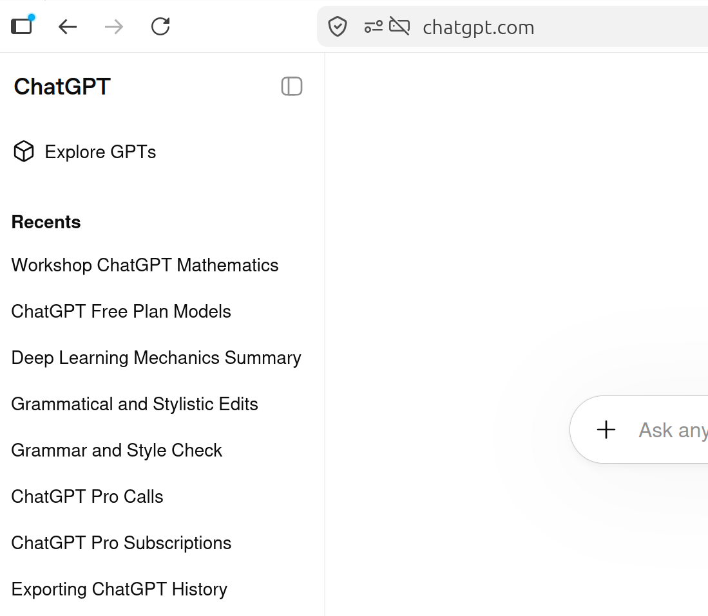
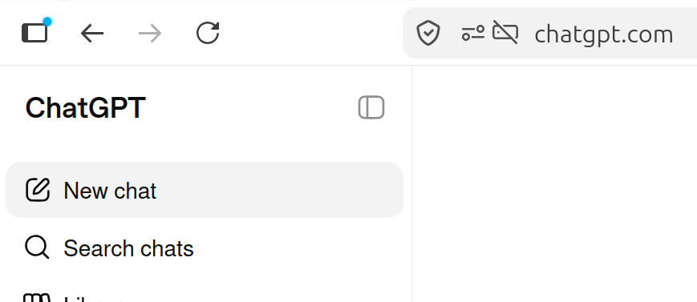
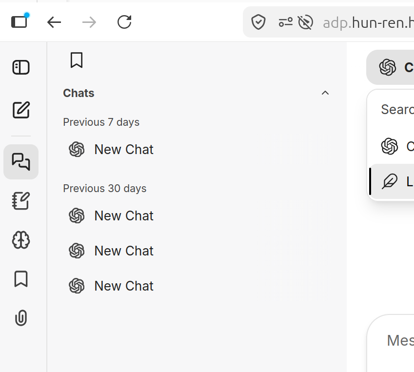
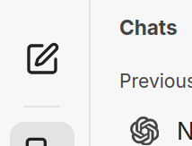
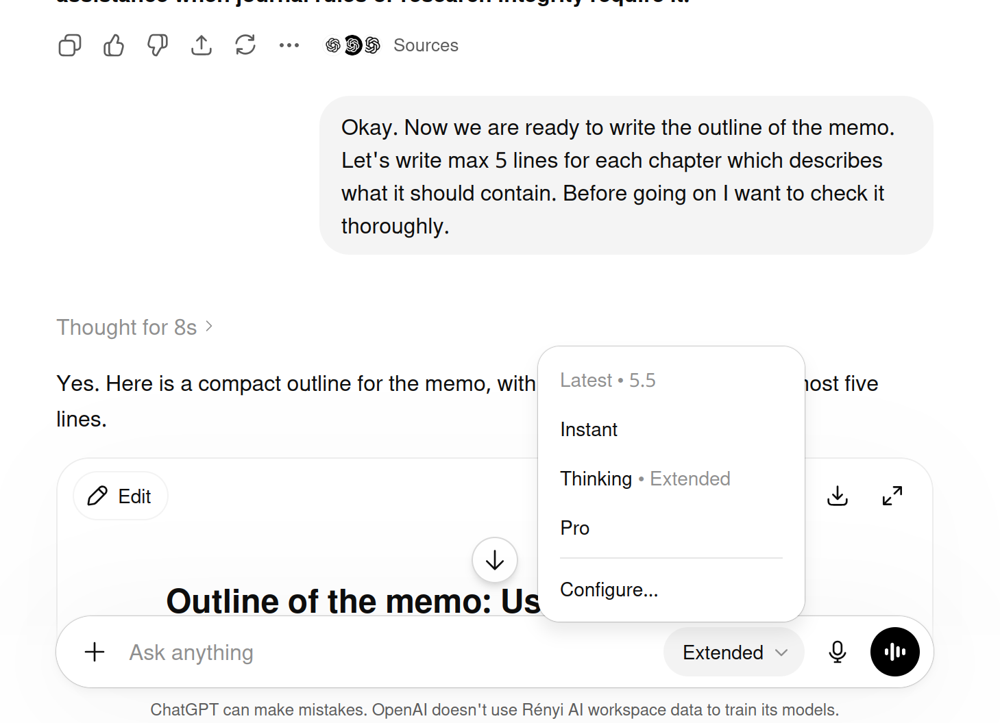
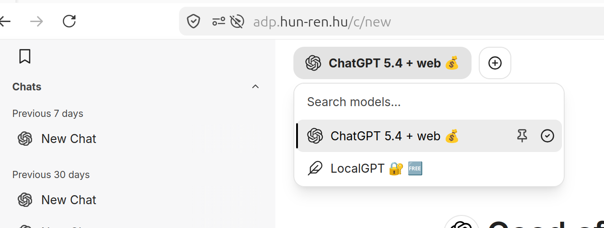

# The ChatGPT user interface
Many are familiar with the chat interface of ChatGPT. It has become a de facto standard for many similar applications. ADP also mirrors this interface, and ADP also provides access to some of the same models as in ChatGPT. That's why we briefly review how it works.

## chats and context
When you open ChatGPT or ADP, you mostly interact with it through a chat interface. You write a message, the system sends your message and the relevant previous context to a language model, and the model writes a response. You can then continue the conversation: ask for clarification, point out mistakes, request examples, change the format, or move to a more precise version of the question. This conversational form is one of the main advantages of ChatGPT: you do not need to formulate the perfect question at once.

A chat is not just a sequence of independent questions. Earlier parts of the conversation can influence later answers. This is useful when you are developing a mathematical idea step by step: you can introduce definitions, assumptions, notation, partial proof attempts, examples, and failed approaches. The model can then work with this shared context. However, the context is not unlimited, and it is not a perfectly reliable mathematical notebook. In a long or messy conversation, the model may overlook earlier details, mix up notation, or continue with assumptions that are no longer what you want. For this reason, it is often useful to start a new chat when you begin a substantially new task. A new chat gives a clean start.

chat history and starting a new chat in ChatGPT:

chat history and starting a new chat in ADP:

## choosing the model
Most ChatGPT interfaces also let you choose a model and model settings. The model is the underlying system that produces the answer. Different models may be optimized for different trade-offs: speed, cost, depth of reasoning, coding ability, tool use, or reliability on hard tasks. For routine tasks such as rewriting text, summarizing short passages, translating, or formatting LaTeX, a faster and cheaper model is often enough. For harder mathematical work, such as checking a proof, searching for counterexamples, debugging a subtle argument, or designing a computational experiment, it is often worth choosing a stronger reasoning-oriented model.

The strongest model is not always necessary, and the cheapest model is not always cheapest if it leads to many failed attempts. A good rule of thumb is: use a fast model for routine work, use a stronger reasoning model when correctness and multi-step reasoning matter, and switch models if the conversation is not progressing.

selecting a model in chatgpt:

selecting a model in ADP:

