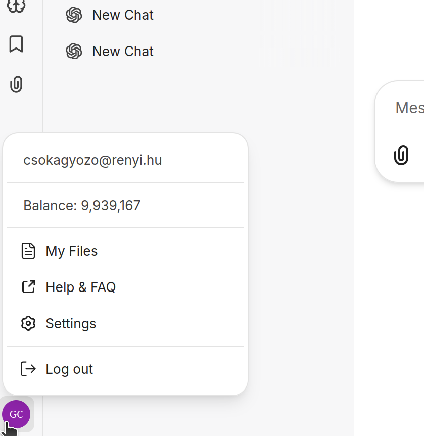

# ADP: access, models, credits, and model choice

## ADP as our access point

For the workshop we will use ADP, the HUN-REN platform that provides access to several digital tools, including ChatGPT. After logging in to ADP, choose one of the ChatGPT models from the available services. 

selecting a model in ADP:

The $ sign near the model indicates the cost of the model requests.

## credits and balance

Each employee receives a certain amount of credit for using ChatGPT through ADP. These credits are consumed when using models. The amount consumed depends on the model and the request: longer prompts, longer answers, large uploaded files, tool use, and stronger reasoning models may use more credit.

In ADP, you can check your remaining balance at the bottom left of the page:

It is worth checking this occasionally, especially if you use stronger models, upload large files, or run many long conversations. The aim is not to be afraid of using credits, but to develop good cost intuition.

## available models

As of the workshop date, the following models are available in ADP:
1. **LocalGPT**: Gemma open-source model running on Science Cloud, suitable for everyday tasks and secure data processing. Available tools: web search, calculator, file search for uploaded files, and an execution environment for running code in its own environment — code interpreter.
2. **gpt-5.4-mini**: Available tools: web search, calculator, and execution environment.
3. **ToolUniverse**: ChatGPT 5.4 model. Available tools: web search, calculator, and more than 2,200 scientific tools curated by ToolUniverse (https://aiscientist.tools).
4. **gpt-5.5** with advanced reasoning capabilities. Available tools: web search, calculator, and execution environment.

The practical question is simple: which model is appropriate for the task? Different models have different trade-offs between speed, cost, reasoning depth, coding ability, tool use, and reliability on hard problems. The available model list may also change over time.

A useful way to think about model choice is the following:

 - use a fast and cheaper model for routine tasks such as rewriting, summarizing, translating, formatting LaTeX, or producing a first rough draft
 - use a stronger reasoning-oriented model for proof checking, counterexample search, difficult mathematical explanations, debugging a subtle argument, or planning a computational experiment
 - use a model with good coding or data-analysis support when the task involves code, tables, calculations, or plots
 - switch models if the conversation is not progressing, the answer is too shallow, or the task turns out to require more careful reasoning.

## cost and model choice

For workshop purposes, the main goal is to learn when model choice matters. If your task is routine, save credits by using a fast model. If your task requires serious reasoning, spend the credit where it helps.